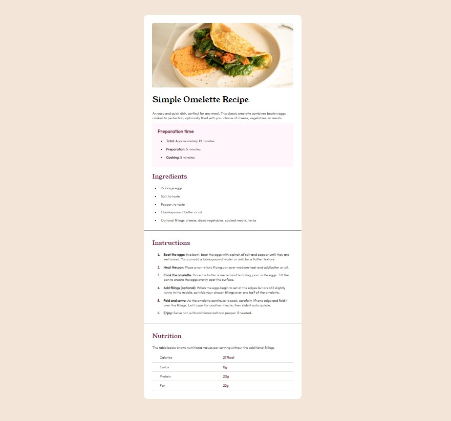

# Frontend Mentor - Recipe page solution

This is a solution to the [Recipe page challenge on Frontend Mentor](https://www.frontendmentor.io/challenges/recipe-page-KiTsR8QQKm). Frontend Mentor challenges help you improve your coding skills by building realistic projects. 

## Table of contents

- [Overview](#overview)
  - [The challenge](#the-challenge)
  - [Screenshot](#screenshot)
  - [Links](#links)
- [My process](#my-process)
  - [Built with](#built-with)
  - [What I learned](#what-i-learned)
  - [Continued development](#continued-development)
  - [Useful resources](#useful-resources)
- [Author](#author)
- [Acknowledgments](#acknowledgments)

**Note: Delete this note and update the table of contents based on what sections you keep.**

## Overview

### Screenshot (zoom-out)




### Links

Pending

## My process

### Built with

- Semantic HTML5 markup
- CSS custom properties
- Mobile-first workflow


### What I learned

Had to find out how to set the ol li marker as in the design. 

Section of HTML and CSS code as below.

```html
 <ol>
    <li>
      <p>
        <strong>Beat the eggs: </strong>In a bowl, beat the eggs ... (continue)
      </p>
    </li>
```
```css

ol li p {
  font-family: outfit-regular;
  margin-left: 0.8rem;
}

ol li::marker {
  color: var(--dark-raspberry);
  font-family: outfit-regular;
  font-weight: 700;
}
```

### Continued development

To continue learning about CSS tricks and available tools.

### Useful resources

- [w3schools](https://www.w3schools.com/) - Provides quick reference on HTML, CSS, and Javascript.
- [mdn web docs](https://developer.mozilla.org/en-US/) - Provides detailed instructions on web developing subjects.


## Author


- Website - [Guillermo Dominguez](https://gdominguez-portfolio.netlify.app)
- Frontend Mentor - [@memominguez](https://www.frontendmentor.io/profile/memominguez)


## Acknowledgments

Thanks to those who support w3schools.com and developer.mozilla.org.

They make possible the web development tasks.

